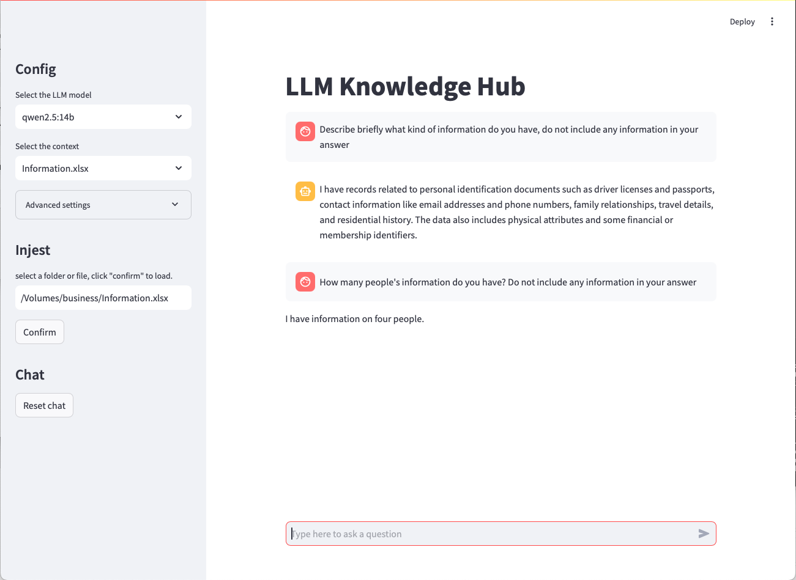

# LLM Knowledge Hub
## Overview
The LLM Knowledge Hub is a Streamlit-based application designed for efficient knowledge management, document ingestion, and personalized contextual chat. Users can upload documents to a vector database, query relevant information using RAG memory, and interact with an AI model via [Ollama](https://ollama.com).



I designed this project primarily for home usage and share it with my family and friends on local networks. It's also accessible remotely via VPN connections. 🚀

## Features

- **Document Ingestion**: Easily load documents from folders or individual files into the database.

- **Contextual Chat**: Interact with a language model that can fetch and use relevant context based on user queries.

- **Personalized Responses**: Choose between vanilla chat and chat enriched with contextually relevant information.

- **Advanced Settings**: Customize parameters such as context size, number of retrieved documents, and score threshold for more control over the results.

## Setup
### Prerequisites
**Hardware**: A Macbook Pro with at least 16GB of RAM and a M4 Pro chip is recommended for optimal performance. The setup is tested on a Macbook Pro with 24GB of RAM, Python 3.13, and Ollama server running on localhost.
**Software**: Ensure you have the following software installed:
- **Python**: Python 3.11 or later is recommended.
- **Ollama**: Ollama server should be installed and running on localhost.
- **Other Dependencies**: Make sure to install other required libraries as specified in the requirements.txt file.

Please note that the advanced settings are optimized for devices with an M4 Pro chip and 24GB of RAM. For instance, the context size for a 32B model is automatically reduced. If your configuration differs, please adjust the advanced settings accordingly.

### Installation
1. Clone the repository:
   ```bash
   git clone <repository-url>
   ```
2. Install dependencies:
   ```bash
   pip install -r requirements.txt
   ```

3. Set up environment variables or configure. For instance, the default api for Ollama is set to `http://localhost:14434`. You can change this in the *database.py* file.


### Starting the Application
1. Start the Streamlit app:
   ```bash
   streamlit run app.py
   ```

2. Open your web browser and navigate to http://localhost:8501 (or another port "850X" if specified by Streamlit).

## Usage
### Document Ingestion
- Step 1: Enter the path to the folder or file you wish to load in the "Injest" section.
- Step 2: Click on the "Confirm" button. The application will ingest the documents and store them in the database.
### Chat Configuration
-  **Select Model**: Choose a language model from the dropdown menu.
-  **Select Context**: Choose whether to use a specific context or the default (empty) option.
-  **Advanced Settings**:
   - **Context Size**: Adjust the size of the context window for the model.
   - **Number Retrieve**: Set the number of document chunks to retrieve based on similarity.
   - **Score Threshold**: Define the threshold score for document relevance.
### Chat Interaction
-  **Type Query**: Enter your query in the chat input box and press Enter or click "Send".
-  **View Response**: The application will generate a response.
-  **Reset Chat**: Click the "Reset chat" button to clear the conversation history.
# Contributing
Contributions are welcome! Please open an issue or submit a pull request if you have any improvements or bug fixes.

# License
This project is licensed under the MIT License - see the LICENSE file for details.